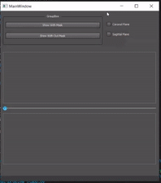

# Problem 5:
<!--Headline-->
<!--Image-->
<!--UL-->
<!-- URLs-->
# Our Simulation for the cough propagation:
# Using CFD (cumulative fluid dynamics) Model in simulation:
# The simulation represnts the propagation for the cough in air:
### Blue color represents the maximun effect for the cough on specific area
### We assumed our barriers in a circular shape
## Without Mask:
### Cough propagation simulation through sagittal plane:
* Most effected area is the nearst area from cough source, cough propagates in air in a high speed and in all directions. 
* From sagittal plane simulation, we are able to know about, how far this cough will reach!, it gives a side view for cough propagation.

### Cough propagation simulation through coronal plane:
* From coronal plane we can recognize the obvious effect behind wearing mask or not, because it reflects a frontal view for cough propagation.

## With Mask:
### Cough propagation simulation through sagittal plane:
* Cough propagation with mask propagates more slowly than without mask.

### Cough propagation simulation through coronal plane:
* Cough propagation with mask propagates more closely than without mask. Without mask, cough propagates more widely.

## Plotting the relation between (cough strength effect) and the distance from it:
### Strength of cough effect reduces when the distance increases.
### The scene is represented as one who considered as the source of cough and the slider represnts someone who receives this cough.

## Comparison between (with) and (without Mask) in the sagittal plane:
### We'll notice that the area of propagation gets smaller when we use mask.

     
## Comparison between (with) and (without Mask) in the coronal plane:
### We'll notice that the area of propagation gets smaller when we use mask.

      

## Simulations were made by using an online free application CFD simulation in 2-D with taking in consideration , the propagation direction, velocity and barriers and air viscosity.
 
