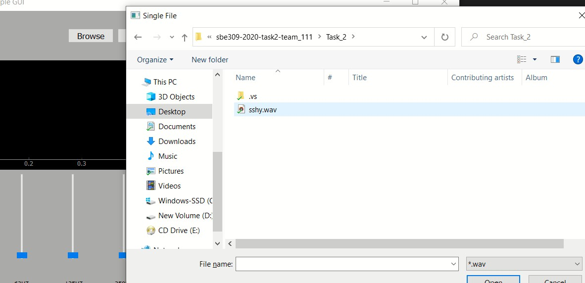
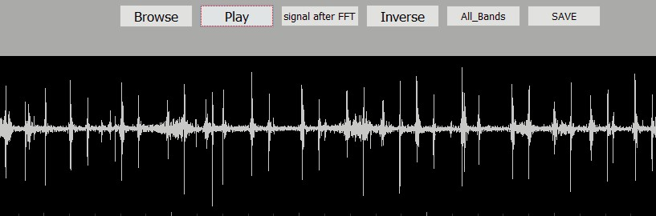
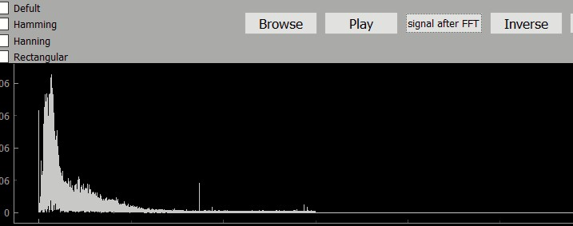
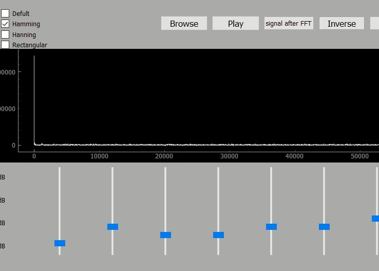
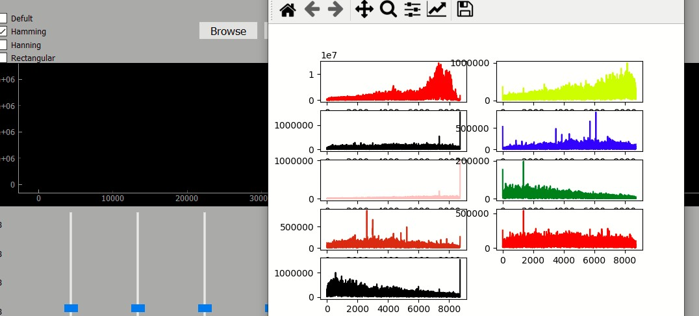
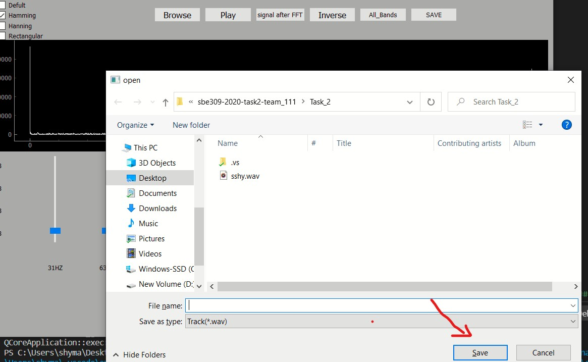
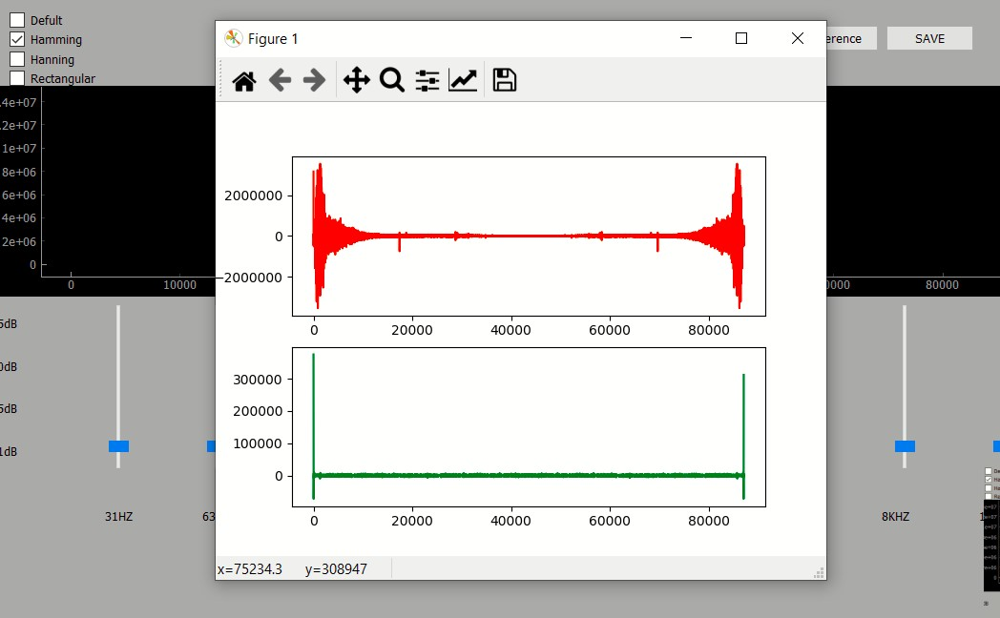

# Description of buttons
## Browse 
> To upload file 

## Play
> To display signal in real time 

## Signal after FFT
> To display signal after fourier transform

## Inverse
> To show  inverse signal after changing
* must select **Hamming** or **Hanning** or **Regtangular**
* must press signal after FFT button to convert signal from time domain to frequancy domain , split bands and make difference on them 
* must move at least one slider to read gain variable  
* 

## ALL Bands
> To display any or all bands as you like after affecting  **Hamming** or **Hanning** or **Rectangular**
* must press Browse button to upload file
* must press signal after FFT button to upload file after fourier transform and split it to different bands
* from check box choose what you want and then move all sliders to see all bands or at least  one slider to see one band    

## save
> To save inverse signal in external file
* Don't forget to follow inverse button  steps for plotting inverse signal then press save  

## Difference
> To show difference between signal in fourier transform and inverse signal after applying **Hamming** or **Hanning** or **Rectangular**
* must press browse button to upload file
* must press **Signal after FFT button** to upload signal in fourier transform
* must select **Hamming** or **Hanning** or **Rectangular** from check bok
* must move all slider to apply changement on bands 
* finally you can press difference button  

# For clarification
you can see file was named main.py 
it contains Defult feature but it has problem when we move all sliders , it gives error becouse of many data are uploaded  and we can't solve this problem becouse of deadline 