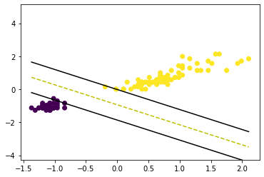

```python
# Importing the necessary libraries
import numpy as np
import matplotlib.pyplot as plt
from sklearn import preprocessing
import pandas as pd
from sklearn.preprocessing import StandardScaler
```


```python
# function for splitting the data into train and test data

def train_test_split_data():
    iris = pd.read_csv('Iris.csv')
    X_train = iris.iloc[:120, 3:5] # 80% training
    X_test = iris.iloc[121:, 3:5]  # 20% testing

    y_train = iris.iloc[:120, -1]
    y_test = iris.iloc[121:, -1]

    le = preprocessing.LabelEncoder()
    y_train = le.fit_transform(y_train)
    y_test = le.fit_transform(y_test)
    #
    y_train = np.where(y_train == 0, -1, 1)
    y_test = np.where(y_test == 0, -1, 1)
    X_train = X_train.values
    X_test = X_test.values
    # scale the data
    scaler = StandardScaler()
    X_train = scaler.fit_transform(X_train)
    X_test = scaler.fit_transform(X_test)
    return X_train, y_train,X_test,y_test


```


```python
# SVM class

class SVM:

    def __init__(self, learning_rate=0.001, lambda_param=0.01, n_iters=1000):
          self.lr = learning_rate
          self.lambda_param = lambda_param
          self.n_iters = n_iters
          self.w = None
          self.b = None

    def fit(self, X, y):
          n_samples, n_features = X.shape

          y_ = np.where(y <= 0, -1, 1)

          self.w = np.zeros(n_features)
          self.b = 0

          for _ in range(self.n_iters):
               for idx, x_i in enumerate(X):
                    condition = y_[idx] * (np.dot(x_i, self.w) - self.b) >= 1
                    if condition:
                         self.w -= self.lr * (1* self.lambda_param * self.w)
                    else:
                         self.w -= self.lr * (1* self.lambda_param * self.w - np.dot(x_i, y_[idx]))
                         self.b -= self.lr * y_[idx]

    def predict(self, X):
          approx = np.dot(X, self.w) - self.b
          return np.sign(approx)

    def score(self, X, y):
          P = self.predict(X)
          return np.mean(y == P)

```


```python
# Function for visualization

def visualize_svm(X,y):
     def get_hyperplane_value(x, w, b, offset):
          return (-w[0] * x + b + offset) / w[1]

     fig = plt.figure()
     ax = fig.add_subplot(1,1,1)
     plt.scatter(X[:,0], X[:,1], marker='o',c=y)

     x0_1 = np.amin(X[:,0])
     x0_2 = np.amax(X[:,0])

     x1_1 = get_hyperplane_value(x0_1, clf.w, clf.b, 0)
     x1_2 = get_hyperplane_value(x0_2, clf.w, clf.b, 0)

     x1_1_m = get_hyperplane_value(x0_1, clf.w, clf.b, -1)
     x1_2_m = get_hyperplane_value(x0_2, clf.w, clf.b, -1)

     x1_1_p = get_hyperplane_value(x0_1, clf.w, clf.b, 1)
     x1_2_p = get_hyperplane_value(x0_2, clf.w, clf.b, 1)

     ax.plot([x0_1, x0_2],[x1_1, x1_2], 'y--')
     ax.plot([x0_1, x0_2],[x1_1_m, x1_2_m], 'k')
     ax.plot([x0_1, x0_2],[x1_1_p, x1_2_p], 'k')

     x1_min = np.amin(X[:,1])
     x1_max = np.amax(X[:,1])
     ax.set_ylim([x1_min-3,x1_max+3])

     plt.show()


```


```python
# Fitting the model on the train dataset 
X_train, y_train,X_test,y_test= train_test_split_data()
clf = SVM()
clf.fit(X_train, y_train)
```


```python
# Prediction on the test dataset
y_pred=clf.predict(X_test)
print(y_pred,"\n",y_test)
# print(clf.w, clf.b)
# print("test-dataset score:", clf.score(X_test,y_test))
# visualize_svm(X_train, y_train)
```

    [-1.  1. -1.  1.  1. -1. -1.  1.  1.  1.  1.  1. -1. -1.  1.  1.  1. -1.
      1.  1.  1. -1.  1.  1.  1. -1.  1.  1. -1.] 
     [-1 -1 -1 -1 -1 -1 -1 -1 -1 -1 -1 -1 -1 -1 -1 -1 -1 -1 -1 -1 -1 -1 -1 -1
     -1 -1 -1 -1 -1]
    


```python
print("the weights = ",clf.w,"the bias = ", clf.b)
```

    the weights =  [1.31016757 1.08017381] the bias =  -1.014999999999999
    


```python
print("test-dataset score:", clf.score(X_test,y_test))
```

    test-dataset score: 0.3448275862068966
    


```python
visualize_svm(X_train, y_train)
```


    

    


```python

```
